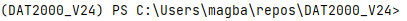

# Oppgaver til øving i DAT2000 22. Januar 2024
Hvis du vil hente ned disse endringene til repoet ditt så kjør fra mappen hvor du har klonet det ut:
```
git add --all
git stash save 
git pull
```
Den første kommandoen mellomlagrer endringene dine ("stasher").
Du kan hente de fram igjen ved å kjøre `git stash apply` ved en senere anledning. 

Vi skal jobbe med to CSV-filer fra tilsyn med serveringssteder, den såkalte smilefjesordningen.

- [Smilefjestilsyn på serveringssteder](https://data.norge.no/datasets/288aa74c-e3d3-492e-9ede-e71503b3bfd9)
- [Kravpunkter for smilefjestilsyn på serveringssteder](https://data.norge.no/datasets/1bf96c45-f8ac-4f2d-bca1-4e5ab4e7c6c6)

Kan være interessant å lese om karakterskalaen for disse kontrollene:

> Karakterskala: 
> 0 = Ingen brudd på regelverket funnet. Stort smil.
> 1 = Mindre brudd på regelverket som ikke krever oppfølging. Stort smil. 
> 2 = Brudd på regelverket som krever oppfølging. Strekmunn. 
> 3 = Alvorlig brudd på regelverket. Sur munn.
> 4 = Ikke aktuelt - Virksomheten har ikke denne aktiviteten ved tilsynsobjektet. Påvirker ikke smilefjeskarakter. 
> 5 = Ikke vurdert - Mattilsynet har ikke vurdert kravpunktet ved dette tilsynet. Påvirker ikke smilefjeskarakter. Dersom det hadde blitt avdekket mistanke om vesentlige eller åpenbare avvik i forbindelse med inspeksjonen, ville kravpunktet blitt vurdert.

fra: https://data.norge.no/datasets/288aa74c-e3d3-492e-9ede-e71503b3bfd9 (hentet 21.01.2024)

Disse kan du laste ned her: 
- [tilsyn.csv](https://hotell.difi.no/download/mattilsynet/smilefjes/tilsyn?download)
- [kravpunkter.csv](https://hotell.difi.no/download/mattilsynet/smilefjes/kravpunkter)

Legg disse filene i mappen "jan22" hvor du har klonet ut denne koden.
Deretter skal vi installere redis-klienten til Python. 
Åpne terminalvindu og sjekk at miljøet er aktivert.
Hos meg står det:



Nå kan vi kjøre 
```
pip install redis
```

For å laste opp datasettet til databasen, skal vi bruke verktøyet Pandas. 

```
pip install pandas pyarrow
```

Oppgavene finnes i notebooken "redis.ipynb".
Åpne denne fra jupyter notebook. 
For å åpne jupyter notebook skriver du bare.
```
jupyter notebook
```

Nå kan du følge instruksjonene i notebooken "redis.ipynb".

